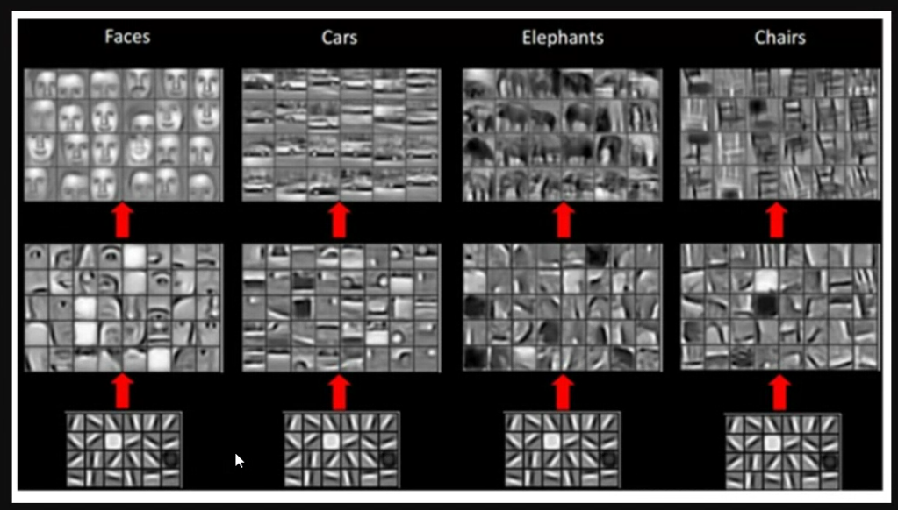

# CNN

## Tipos de capas

### Capa de convolusión
Se definen el número de filtros que se proporcionarán, y el tamaño de los filtros.

Conforme se mueve el filtro en los datos de entrada, se estará activando o no y la salida mostrará la combinación dada por la funcion de activación con los datos originales.

### Capa Pooling
Capa que reducira la dimensionalidad de los datos.
Existen 2 tipos de pooling, max pooling y average pooling. 

### Capa Fully connected
La matriz resultante del pooling, la vectorizaremos y cada casilla del vector será equivalente a un dato de entrada que se le dará a la red neuronal.

## Hyperparameters

### Dimensión de los filtros

Hay que basarnos en arquitecturas ya realizadas para la elección del tamaño de los filtros de convolusión.

#### $FxFxC$
$FxF$: refiere al tamaño del filtro en pixeles.
$C$: refiere a la cantidad de canales, en las imagenes pueden ser 3 o 4, o si es escala de grises 1 canal.

### Stride
Se refiere al salto entre cada analisis unitario de un filtro, se aplica el filtro en una zona y el stride dice cuanto se va a desplazar para analizar la siguiente zona.

### Zero-padding
Valid, same, o Full.
Depende del tamaño del filtro, y es para no perder información a la hora de analizar la información de la imagen.

## Tuning hyperparameters
$O=\frac{I-F+P_{start}+P_{end}}{S}+1$

---

La red neuronal aprende los filtros a usar, para que al pasar una imagen por ellos, obtengamos el output deseado.

## Ejecicio con CIFAR 10
Una base de datos de imagenes con 10 distintas clasificaciones.

Las capas cambian por capas de convolusión, capas de pooling.

La funcion de perdida cambia por `SparseCategoricalCrossEntropy`.

Un modelo sobreentrenado no generaliza, memoriza los datos, por lo que no va a servir.

Como los datos de validación y de entrenamiento no se distancian tanto, todavía está bien.